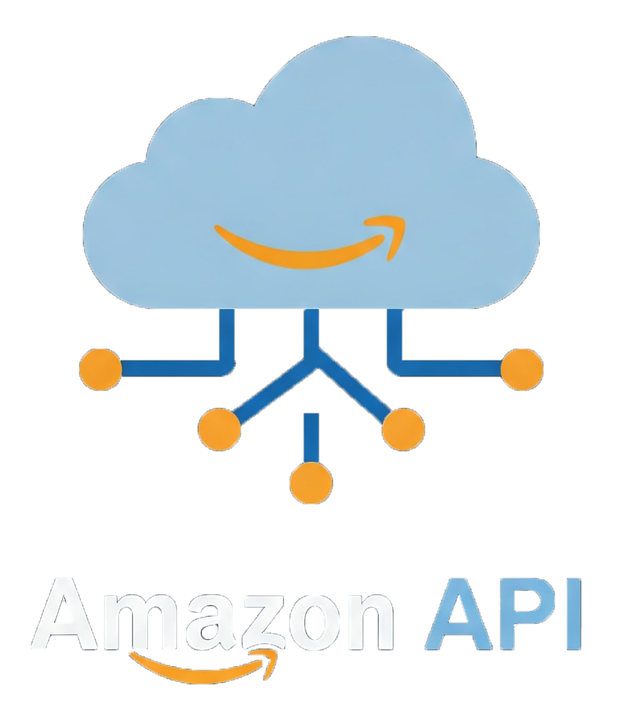

# 🛒 Projeto API Amazon - Web Scraper

Este projeto é uma aplicação fullstack simples que permite buscar produtos diretamente no site da Amazon com base em uma palavra-chave. Os resultados são apresentados de forma visual e interativa ao usuário, utilizando scraping de dados do frontend para o backend.

## 📸 Demonstração

<p align="center">
    
</p>

## 📦 Tecnologias Utilizadas

### Frontend
- HTML5, CSS3, JavaScript
- Axios para requisições HTTP

### Backend
- Node.js com Express
- Axios para scraping
- JSDOM para parsing de HTML
- CORS para comunicação entre frontend e backend

---

## 🚀 Funcionalidades

- Campo de pesquisa com validação
- Exibição de produtos com imagem, título, avaliação e preço
- Loader animado enquanto carrega
- Tratamento de erros com mensagens amigáveis
- Responsividade e estilo limpo

---

## ⚙️ Como Executar o Projeto

### 1. Clone o repositório

```bash
git clone https://github.com/seu-usuario/seu-repositorio.git
cd seu-repositorio

```
### 2. Instale as dependências

```bash
npm install

```
### 3. Inicie o backend

```bash
node app.js

```
### 4. Inicie o frontend

```bash
npm run dev
```

## 📂 Estrutura de Pastas
```bash
    DESAFIO-TECNICO/
    ├── backend-amazon/
    │   ├── node_modules/
    │   ├── app.js
    │   ├── package.json
    │   ├── package-lock.json
    │   └── statusPagina.js
    │
    ├── frontend-amazon/
    │   ├── node_modules/
    │   ├── public/
    │   ├── src/
    │   │   ├── css/
    │   │   │   ├── style.css
    │   │   │   └── variaveis.css
    │   │   └── js/
    │   │       └── main.js
    │   ├── .gitignore
    │   ├── index.html
    │   ├── package.json
    │   └── package-lock.json
    │
    ├── README.md
```

## 🧠 Considerações Finais
Este projeto foi desenvolvido para fins educacionais e demonstração prática de scraping com Node.js, utilizando Express, Cheerio e Axios.
O código foi baseado em um teste de processo seletivo, com o objetivo de demonstrar conhecimento técnico nas ferramentas utilizadas.

Como a Amazon não disponibiliza uma API pública para todos os produtos, os dados são obtidos por meio de scraping, o que pode apresentar limitações como:

- Mudanças na estrutura da página afetando o parser;
- Possíveis bloqueios do servidor da Amazon após muitas requisições;
- Informações que podem não estar sempre atualizadas em tempo real.

## 📬 Contato
Feito com 💻 por Rafael Silva

- 🎥 YouTube: Programador da Silva : https://www.youtube.com/@ProgramadordaSilva
- 💼 LinkedIn: Rafael Silva : https://www.linkedin.com/in/rafaelsantana27/

### 📂 Código disponível para estudos e aprimoramentos.

